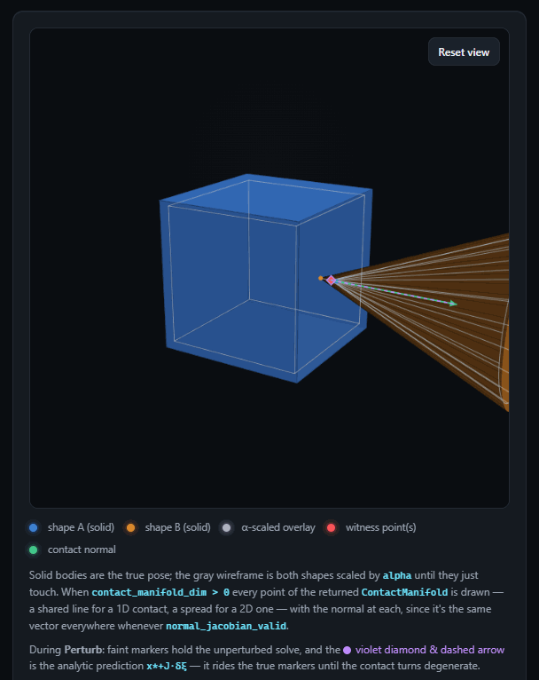

<h1 align="center">DCOL++</h1>

<p align="center">
  
</p>
<p align="center"><sub>the real solver in WebAssembly &mdash; cube vs. cone, the <b>alpha</b>-scaled overlay (the SOCP), the witness points and contact normal, and (violet) the <b>analytic</b> first-order prediction <code>x* + J&middot;&delta;&xi;</code> riding the re-solved contact as <code>g</code> is perturbed</sub></p>

<p align="center">
  
  
  
  <a href="https://gvsrobotics.github.io/DCOLpp"></a>
  <a href="LICENSE"></a>
</p>

<p align="center"><b>Differentiable collision detection for convex 3D primitives — with exact, analytic first and second derivatives.</b></p>

DCOL++ turns each proximity query between two convex bodies into a fixed-size
second-order-cone program and differentiates it through the KKT system. The
result: a smooth **penetration / separation measure**, the **witness points**
and **contact normal**, and their derivatives with respect to the relative
`SE(3)` pose — computed by hand-derived formulas, **no autodiff and no finite
differences** in the build. It is meant to drop into physics engines,
trajectory optimizers, and contact-rich planners.

**Try it in the browser:** [**gvsrobotics.github.io/DCOLpp**](https://gvsrobotics.github.io/DCOLpp)
— the real solver compiled to WebAssembly, with the live "perturb `g` and
watch the analytic Jacobian track the re-solved contact" view shown above.

## Contents

- [Features](#features)
- [Install](#install)
- [Quickstart](#quickstart)
- [The queries](#the-queries)
- [Supported shapes](#supported-shapes)
- [How it works](#how-it-works)
- [Performance](#performance)
- [Testing](#testing)
- [Limitations](#limitations)
- [Roadmap](#roadmap)
- [Credits &amp; citing](#credits--citing)
- [License](#license)

## Features

- **Proximity + contact** for 8 bounded convex primitives and a half-space
  `Plane`: the scale-to-touch measure `alpha`, the witness point, per-body
  witness points, the unit contact normal, and a signed gap.
- **Analytic derivatives, both orders** — `d(alpha)/dxi`, `d[witness;alpha]/dxi`,
  `d(normal)/dxi`, `d(gap)/dxi`, all w.r.t. the 6-DOF relative twist. The
  second derivative is what makes $\frac{d(normal)}{dxi}$ exact; there is no autodiff
  path.
- **Degeneracy aware** — detects line / face contacts and non-unique normals
  (polytope edges & vertices), and returns a multi-point **contact manifold**
  with per-point Jacobians. Available on the value query, not just the
  Jacobian one.
- **Warm-started** — a persistent per-pair handle; a near-static contact then
  reconverges in about one iteration, a fast-moving one falls back to cold
  automatically.
- **Small and dependency-light** — C++17 on Eigen, fixed-size linear algebra,
  no heap in the hot path.

## Install

Eigen 3.4+ is the only dependency (found via `find_package(Eigen3)`, or
fetched automatically). Drop DCOL++ into a CMake project and link the
`dcolpp_socp` target:

```cmake
include(FetchContent)
FetchContent_Declare(dcolpp
  GIT_REPOSITORY https://github.com/GVSRobotics/DCOLpp.git
  GIT_TAG        main)
FetchContent_MakeAvailable(dcolpp)

target_link_libraries(your_target PRIVATE dcolpp_socp)   # pulls in dcolpp_se3 + Eigen
```

Or `add_subdirectory(path/to/DCOLpp)`. Everything a caller needs is in
`#include "dcolpp/socp/contact.hpp"`.

**Build the repo itself** (tests + demo benches):

```bash
cmake -S . -B build -G Ninja -DCMAKE_BUILD_TYPE=Release -DCMAKE_CXX_COMPILER=clang++
cmake --build build
ctest --test-dir build
```

clang / LLVM-mingw is recommended — 1.1–1.5× faster on this code than GCC,
with no compiler-specific source. On Windows,
`winget install MartinStorsjo.LLVM-MinGW.UCRT` and put its `bin/` on `PATH`
(the binaries link `libc++` / `libunwind`). Drop `-DCMAKE_CXX_COMPILER` to
use MinGW-GCC.

## Quickstart

```cpp
#include <Eigen/Dense>
#include <iostream>
#include "dcolpp/socp/contact.hpp"

int main() {
    using namespace dcolpp::socp;

    // a unit cube (half-side 0.5), as six half-spaces |x_i| <= 0.5
    Eigen::Matrix<double, 6, 3> A;
    A << 1,0,0, -1,0,0,  0,1,0,  0,-1,0,  0,0,1,  0,0,-1;
    Eigen::Matrix<double, 6, 1> b = Eigen::Matrix<double, 6, 1>::Constant(0.5);
    Polytope<6> cube(A, b);

    // a cone: height 1.5, half-angle ~25 deg, axis = local +x
    Cone cone(1.5, 0.4363);

    // relative pose g = g1^-1 g2  (cube is body 1, at the origin)
    Eigen::Matrix4d g = Eigen::Matrix4d::Identity();
    g(2, 3) = 1.2;                                   // cone shifted +1.2 along z

    ProximityContactResult r = proximityContact(cube, cone, g);
    std::cout << "alpha   = " << r.alpha << "\n";    // <1 hit, =1 touch, >1 apart
    std::cout << "witness = " << r.witness_point.transpose() << "\n";
    std::cout << "normal  = " << r.normal.transpose() << "\n";
    std::cout << "gap     = " << r.gap << "\n";      // signed distance-ish measure
}
```

`alpha` is DCOL's proximity measure: the uniform scale both shapes must be
grown by, about the common witness point, to make them just touch. `< 1`
penetrating, `== 1` touching, `> 1` separated — **not** a Euclidean distance.

## The queries

Every entry point is in `dcolpp/socp/contact.hpp` (or `proximity.hpp` for the
first three). With `cube`, `cone`, `g` as above:

| call | returns |
|---|---|
| `proximity(a, b, g)` | `alpha`, `witness_point` |
| `alphaGradient(a, b, g)` | `d(alpha)/dxi` (1×6) — O(1) after the solve, no linear system |
| `proximityJacobian(a, b, g)` | `d[witness; alpha]/dxi` (4×6) |
| `proximityContact(a, b, g, opt)` | + unit contact `normal`, per-body `witness_body1` / `witness_body2`, signed `gap`, and (opt-in) the degeneracy diagnostics + contact manifold |
| `proximityContactJacobian(a, b, g, opt)` | + `jacobian` (4×6), `normal_jacobian` (3×6), the witness / gap Jacobians, and per-manifold-point Jacobians |

```cpp
ProximityContactJacobianResult r = proximityContactJacobian(cube, cone, g);
// r.jacobian         : 4x6, rows [d wx; d wy; d wz; d alpha] / dxi
// r.normal_jacobian  : 3x6, d(normal)/dxi

// x* (the shared witness of the alpha-scaled bodies) mapped back onto each
// body's real surface, plus the signed gap. All in body-1 frame, r = g.translation():
// r.witness_body1 = x*/alpha            r.witness_body2 = r + (x* - r)/alpha
// r.gap           = (1 - 1/alpha)*||r||           ( > 0 apart, < 0 penetrating )
// r.witness_body1_jacobian, r.witness_body2_jacobian (3x6), r.gap_jacobian (1x6)
```

### Conventions

* **Frame.** Shape 1 sits at the origin; shape 2's pose is `g` (`= g1^-1 g2`).
  Every returned point, vector, and Jacobian is in **shape 1's frame**.
* **Twist.** Derivatives are w.r.t. `xi = [omega; v]` in R^6 — a body twist of
  shape 2, rotation-first, applied by exact right-multiplication
  `g(xi) = g * Exp(xi)`. First three Jacobian columns rotational, last three
  translational.
* **To robot generalized coordinates `q`:** `dY/dq = (dY/dxi) * J_rel(q)`,
  with `J_rel` the relative body Jacobian of the pair (just shape 2's body
  Jacobian if shape 1 is world-fixed), rows ordered `[angular; linear]`.

### Degenerate contacts

At a line / face contact (parallel faces, aligned edges, a matched vertex)
the *values* — `alpha`, witness, normal — are still correct, but the
witness-point and/or normal Jacobian becomes ill-posed. Opt in to the
diagnostics (on either contact query):

```cpp
SocpOptions opt;
opt.compute_contact_manifold = true;

auto r = proximityContact(cube, cone, g, opt);        // or proximityContactJacobian(...)
// r.contact_manifold_dim   : 0 point / 1 line / 2 face
// r.normal_cone_dim        : > 0 at a polytope edge or vertex (normal not unique)
// r.witness_jacobian_valid : false iff contact_manifold_dim > 0
// r.normal_jacobian_valid  : false iff normal_cone_dim   > 0
// r.contact_manifold_points : 1 / 2 / K points spanning the contact region
// r.contact_manifold_witnesses[i] : per-point per-body witnesses + gap
```

`alpha` and its gradient stay well-defined in every case — only the witness
point and the normal have Jacobians that can degrade, which is exactly what
the `dim` fields and `*_valid` flags report.

### Warm-starting

For a physics step or traj-opt loop hitting the same pair at slowly-changing
poses, pass a persistent handle:

```cpp
ContactWarmState<Polytope<6>, Cone> ws;      // one per persistent contact pair
for (...) {
    auto r = proximityContactJacobian(cube, cone, g_now, opt, &ws);   // seeds from the last solve
}
```

A near-static contact reconverges in about one iteration; a fast-moving one
falls back to a cold solve automatically. `nullptr` (the default) *is* the
cold path, byte for byte.

## Supported shapes

All in the `dcolpp::socp` namespace, each defined in its own frame:

```cpp
Sphere(R)
Capsule(R, L)                       // radius R, segment length L, axis +x
Cylinder(R, L)                      // radius R, length L, axis +x
Cone(H, beta)                       // height H, half-angle beta (rad), axis +x
TruncatedCone(R_bottom, R_top, L)   // cone frustum, axis +x   (DCOL++-native)
Ellipsoid(a, b, c)                  // semi-axes along local x, y, z
Polytope<NH>(A, b)                  // { x : A x <= b },  A is NH x 3
Polygon<NH>(A, b, R)                // 2D convex polygon (A is NH x 2), puffed by radius R
Plane(normal, point)               // half-space through `point` with unit `normal`; body 1 only
```

Any pair is valid and either shape may move — except `Plane`, which is always
the first (static) shape. A `Plane` does not scale (its surface is fixed at
`normal·x = normal·point`); only the moving body scales, so for it
`alpha = |signed distance| / extent`. If the moving body's centre is on the
`-normal` side, the row is flipped, `normal` comes back as `-Plane.normal`,
and `plane_flipped` is set.

## How it works

Each query is the second-order-cone program

```
minimize   alpha    s.t.   G(g) x + s = h(g),   s in K = R_+^m x SOC x SOC
```

over `x = [witness(3); alpha(1); extras]`. `G, h` are assembled per shape
(`problem_matrices.hpp`); a Nesterov–Todd-scaled predictor–corrector
interior-point solver (`solver.hpp`) drives it to the KKT point. Derivatives
come from the **implicit function theorem** on that KKT system — a block
elimination `A = G'(S^-1 Z)G`, then `dx/dxi`, `dz/dxi` — plus hand-derived
per-shape `d(Gx)/dxi` / `d(h)/dxi` and a closed-form frozen Hessian for the
second order. `dcolpp::se3` supplies the exact `SE(3)` exponential and its
first-derivative primitives, so the whole chain is analytic. No autodiff, no
FD.

## Performance

Faster than the Julia original it is based on. On the shared 9-pair
`proximity_jacobian` benchmark (`tools/bench_socp.cpp` vs. the equivalent
for DifferentiableCollisions.jl, `pdip_tol = 1e-10`, same machine): DCOL++ totals **~48 µs / call across the 9 pairs vs ~130 µs**
for `DifferentiableCollisions.jl` — roughly **2–3× faster**, more on the
polytope-heavy pairs. (Head-to-head numbers vary with how carefully Julia is
measured — one process vs one-per-pair to isolate GC; the re-implementation
didn't cost speed, it gained it.) The C++ side runs in ~2–9 µs per pair
depending on iteration count.

## Testing

```bash
ctest --test-dir build            # 137 cases, ~8.5k assertions
```

Every derivative is checked against **central finite differences of the exact
`Exp`**, and the SOCP core against the **actual `DifferentiableCollisions.jl`
output** for the 7 shared shapes chained pairwise (`test_socp_julia_parity`).

## Limitations

- **Conditioning near touching.** `A = G'(S^-1 Z)G` reaches `cond(A) ~ 1e13`
  when a SOC block sits on its boundary — which, for a "scale until they just
  touch" formulation, is every converged solution. The witness-point rows of
  the Jacobian lose precision gracefully (`~ roundoff * cond(A)`, always
  finite); `alpha`'s row (the envelope quantity) is unaffected. This is
  structural to KKT-based differentiable optimization, not specific to DCOL++.
- **Piecewise-smooth at active-set changes.** At a genuine polytope
  edge/vertex contact the solution map has a real kink; what is returned is a
  valid one-sided, branch-specific derivative — fine for one local
  optimization step, not a global unique derivative. The `*_valid` flags
  report it.
- **Heuristic thresholds** in the degeneracy tests are scale-aware but
  validated on a fixed set of configurations, not proven for arbitrary shape
  scale.
- Research code — APIs may change.

## Roadmap

`dcolpp::implicit` — a second engine for smooth strictly-convex **implicit**
shapes (superellipsoid, superelliptic cylinder, smoothed polytope) from
[iDCOL](https://gvsrobotics.github.io/iDCOL), posing membership of the scaled
shape as a non-linear condition solved by a fixed-size Newton–KKT system
rather than a cone program. See `include/dcolpp/implicit/`.

## Credits & citing

The SOCP proximity engine is a C++/Eigen re-implementation, re-targeted to
relative `SE(3)` poses and extended (second derivative, contact degeneracy,
multi-point manifolds, warm-starting, `TruncatedCone`, `Plane`, geometric
init), of Kevin Tracy's **DifferentiableCollisions.jl** (MIT). The geometric
cold-start and the implicit-shape roadmap draw on **iDCOL**. Full attribution:
[NOTICE.md](NOTICE.md).

```bibtex
@article{tracy2023differentiable,
  title   = {Differentiable Collision Detection for a Set of Convex Primitives},
  author  = {Tracy, Kevin and Howell, Taylor A. and Manchester, Zachary},
  journal = {IEEE International Conference on Robotics and Automation (ICRA)},
  year    = {2023}
}

@article{mathew2026idcol,
  title   = {Collision Detection with Analytical Derivatives of Contact Kinematics},
  author  = {Mathew, Anup Teejo and Peringal, Anees and Caradonna, Daniele
             and Boyer, Frederic and Renda, Federico},
  journal = {IEEE Robotics and Automation Letters (RA-L)},
  year    = {2026}
}
```

## License

MIT — see [LICENSE](LICENSE) and [NOTICE.md](NOTICE.md) (attribution for the
DifferentiableCollisions.jl and iDCOL lineages).
