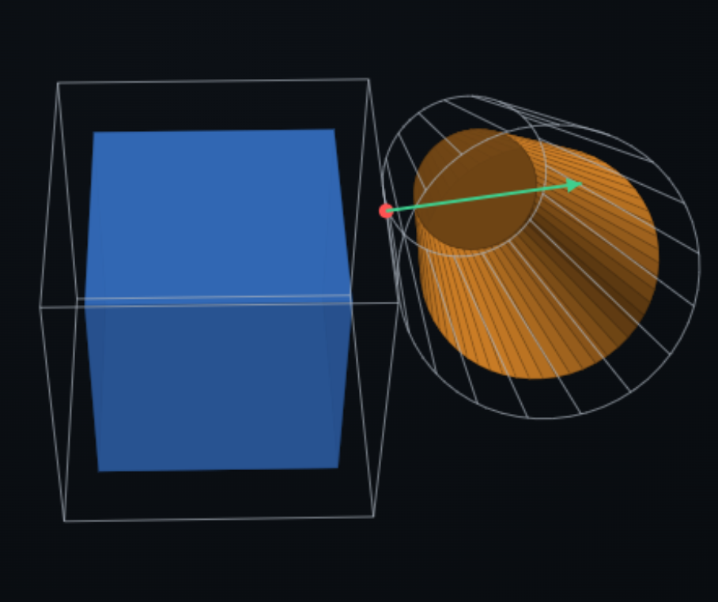

<p align="center">
  
</p>

# DCOL++

DCOL++ is a differentiable collision-detection library for convex 3D
primitives, built for gradient-based simulation, planning, and trajectory
optimization in contact-rich robotics. Every proximity query is
differentiable with respect to the relative SE(3) pose of the two bodies —
analytically, with no autodiff and no finite differences in the build.

**Website / demo:** [gvsrobotics.github.io/DCOLpp](https://gvsrobotics.github.io/DCOLpp) — an in-browser (WebAssembly) playground.

**Built on:** the second-order-cone proximity formulation and interior-point
solver of
[DifferentiableCollisions.jl](https://github.com/kevin-tracy/DifferentiableCollisions.jl)
(Kevin Tracy, MIT), re-targeted to relative SE(3) poses and substantially
extended. The geometric cold-start and the implicit-shape roadmap draw on
[iDCOL](https://gvsrobotics.github.io/iDCOL). What is a faithful port and what
is new is spelled out in [DEVIATIONS.md](DEVIATIONS.md); full credits are in
[NOTICE.md](NOTICE.md).

It provides:

* proximity, contact points, and contact normals for 8 convex primitives,
* analytical first **and second** derivatives of every query with respect to
  the 6-DOF relative twist,
* contact-degeneracy detection and multi-point contact manifolds for
  face and edge contacts,
* warm-started tracking for temporally-continuous queries,
* a compact C++17 API on Eigen, sized for physics engines and optimizers.

At its core, DCOL++ reduces each query to a fixed-size second-order-cone
program and differentiates it through the KKT system, so results are fast,
exact, and smooth wherever the contact is non-degenerate.

---
## Quickstart (C++)

1. Create two shapes (each defined in its own frame)
2. Pick the relative pose `g = g1^-1 g2`
3. Query

```cpp
#include <Eigen/Dense>
#include <iostream>
#include "dcolpp/socp/contact.hpp"

int main() {
    using namespace dcolpp::socp;

    // --- 1) shapes ---
    // a unit cube (half-side 0.5), as six half-spaces |x_i| <= 0.5
    Eigen::Matrix<double, 6, 3> A;
    A << 1,0,0, -1,0,0,  0,1,0,  0,-1,0,  0,0,1,  0,0,-1;
    Eigen::Matrix<double, 6, 1> b = Eigen::Matrix<double, 6, 1>::Constant(0.5);
    Polytope<6> cube(A, b);

    // a cone: height 1.5, half-angle ~25 deg (radians), axis = local +x
    Cone cone(1.5, 0.4363);

    // --- 2) relative pose: cone shifted +1.2 along z, no rotation ---
    Eigen::Matrix4d g = Eigen::Matrix4d::Identity();
    g(2, 3) = 1.2;

    // --- 3) query ---
    ProximityContactResult r = proximityContact(cube, cone, g);

    std::cout << "alpha      = " << r.alpha << "\n";            // <1 hit, =1 touch, >1 apart
    std::cout << "witness pt = " << r.witness_point.transpose() << "\n";
    std::cout << "normal     = " << r.normal.transpose() << "\n";
}
```

`alpha` is the uniform scale both shapes must be grown by (about the common
witness point) to make them just touch — DCOL's proximity measure, not a
Euclidean distance: `< 1` penetrating, `== 1` touching, `> 1` separated.

Link against the `dcolpp_socp` CMake target (it pulls in `dcolpp_se3` and
Eigen).

---
## Querying derivatives

Every entry point is in `dcolpp/socp/contact.hpp`. With `cube`, `cone`, `g`
as above:

| call | returns |
|---|---|
| `proximity(a, b, g)` | `alpha`, `witness_point` |
| `alphaGradient(a, b, g)` | `d(alpha)/dxi` (1x6) — O(1) after the solve, no linear system |
| `proximityJacobian(a, b, g)` | `d[witness; alpha]/dxi` (4x6) |
| `proximityContact(a, b, g)` | the above **+** the unit contact `normal` |
| `proximityContactJacobian(a, b, g, opt)` | `jacobian` (4x6), `normal_jacobian` (3x6), and — opt-in — degeneracy diagnostics and a contact manifold |

```cpp
AlphaGradientResult ag = alphaGradient(cube, cone, g);
// ag.grad : 1x6,  [ d/d-omega (3) | d/d-v (3) ]

ProximityContactJacobianResult r = proximityContactJacobian(cube, cone, g);
// r.jacobian        : 4x6, rows [d wx; d wy; d wz; d alpha] / dxi   (row 3 == ag.grad)
// r.normal_jacobian : 3x6, d(normal)/dxi   (uses the analytic 2nd derivative internally)
```

### Conventions

* **Frame.** Shape 1 sits at the origin; shape 2's pose is `g` (`= g1^-1 g2`).
  Every returned point, vector, and Jacobian is in **shape 1's frame**.
* **Twist.** Derivatives are with respect to `xi = [omega; v]` in R^6, a body
  twist of shape 2, rotation-first, applied by exact right-multiplication
  `g(xi) = g * Exp(xi)`. The first three Jacobian columns are rotational, the
  last three translational.
* **To robot generalized coordinates `q`:** `dY/dq = (dY/dxi) * J_rel(q)`,
  with `J_rel` the relative body Jacobian of the pair (just shape 2's body
  Jacobian if shape 1 is world-fixed), rows ordered `[angular; linear]`. See
  [DEVIATIONS.md](DEVIATIONS.md) section 2.

### Degenerate contacts

When the true contact is a line or a face (parallel cube/cone faces, aligned
edges, a matched vertex), `alpha`, the witness point, and the normal are
still correct as *values*, but the witness-point and/or normal Jacobian
becomes ill-posed. Opt in to the diagnostics:

```cpp
SocpOptions opt;
opt.compute_contact_manifold = true;

auto r = proximityContactJacobian(cube, cone, g, opt);
// r.contact_manifold_dim   : 0 point / 1 line / 2 face
// r.normal_cone_dim        : >0 at a polytope edge or vertex (normal not unique)
// r.witness_jacobian_valid : false iff contact_manifold_dim > 0
// r.normal_jacobian_valid  : false iff normal_cone_dim > 0
// r.contact_manifold_points          : 1 / 2 / K points spanning the contact region
// r.contact_manifold_point_jacobians : per-point {jacobian, normal_jacobian}
```

`alpha` and its gradient stay well-defined in every case — it is only the
witness point and the normal whose Jacobians can degrade, which is exactly
what the two `dim` fields and `*_valid` flags report.

### Warm-starting

For a physics step or traj-opt loop that hits the same pair at
slowly-changing poses, pass a persistent handle:

```cpp
ContactWarmState<Polytope<6>, Cone> ws;      // one per persistent contact pair
for (...) {
    auto r = proximityContactJacobian(cube, cone, g_now, opt, &ws);   // seeds from the last solve
}
```

A near-static contact then converges in about one iteration; a fast-moving
one falls back to a cold solve automatically. `nullptr` (the default) *is*
the cold path, byte for byte.

---
## Supported shapes

All in the `dcolpp::socp` namespace, each defined in its own frame:

```cpp
Sphere(R)
Capsule(R, L)                       // radius R, segment length L, axis +x
Cylinder(R, L)                      // radius R, length L, axis +x
Cone(H, beta)                       // height H, half-angle beta (rad), axis +x
TruncatedCone(R_bottom, R_top, L)   // cone frustum, axis +x   (DCOL++-native)
Ellipsoid(a, b, c)                  // semi-axes along local x, y, z
Polytope<NH>(A, b)                  // { x : A x <= b },  A is NH x 3
Polygon<NH>(A, b, R)                // 2D convex polygon (A is NH x 2), puffed by radius R
```

Any pair is valid, and either shape may be the moving body.

---
## Requirements

* CMake (>= 3.16)
* A C++17 compiler — **clang / LLVM-mingw recommended** (1.1-1.5x faster on
  this code than GCC; there is no compiler-specific code and GCC is a
  supported fallback)
* Eigen3 (>= 3.4) — located via `find_package(Eigen3)`, or fetched
  automatically if not found

---
## Building

### Linux / macOS

```bash
cmake -S . -B build -G Ninja -DCMAKE_BUILD_TYPE=Release -DCMAKE_CXX_COMPILER=clang++
cmake --build build
ctest --test-dir build
```

### Windows

```bash
winget install MartinStorsjo.LLVM-MinGW.UCRT
cmake -S . -B build -G Ninja -DCMAKE_BUILD_TYPE=Release -DCMAKE_CXX_COMPILER=clang++
cmake --build build
ctest --test-dir build
```

Put the LLVM-mingw `bin/` on `PATH` before running the binaries too — they
dynamically link `libc++` / `libunwind`. To build with MinGW-GCC instead,
drop `-DCMAKE_CXX_COMPILER` (CMakeLists.txt has no compiler-specific logic;
it is just slower).

---
## Design philosophy

* One relative SE(3) pose per pair, not absolute world states
* A fixed-size second-order-cone program per query
* Analytical derivatives first — no autodiff, no finite differences
* Both derivative orders (the second is what makes `normal_jacobian` exact)
* Warm-start as a first-class path, not a bolt-on

---
## Status

This is active research code accompanying ongoing work on differentiable
contact. It is usable but evolving; APIs and interfaces may change without
notice. Provided as-is for research and experimentation.

The SOCP proximity engine is a C++/Eigen re-implementation of Kevin Tracy's
**DifferentiableCollisions.jl** (MIT). If you use it, please cite that work:

```bibtex
@article{tracy2023differentiable,
  title   = {Differentiable Collision Detection for a Set of Convex Primitives},
  author  = {Tracy, Kevin and Howell, Taylor A. and Manchester, Zachary},
  journal = {IEEE International Conference on Robotics and Automation (ICRA)},
  year    = {2023}
}
```

The geometric cold-start and the implicit-shape roadmap draw on **iDCOL**:

```bibtex
@misc{mathew2026collisiondetectionanalyticalderivatives,
      title={Collision Detection with Analytical Derivatives of Contact Kinematics},
      author={Anup Teejo Mathew and Anees Peringal and Daniele Caradonna and Frederic Boyer and Federico Renda},
      year={2026},
      eprint={2602.03250},
      archivePrefix={arXiv},
      primaryClass={cs.RO},
      url={https://arxiv.org/abs/2602.03250},
}
```
